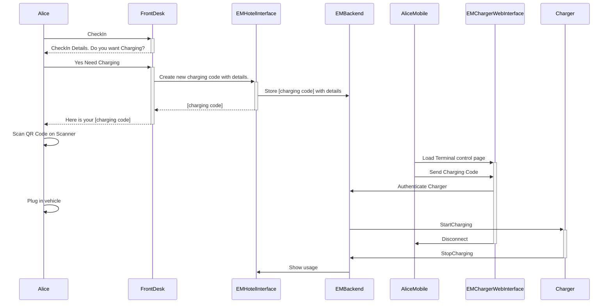
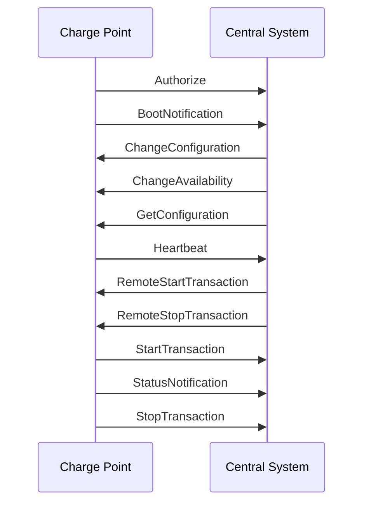
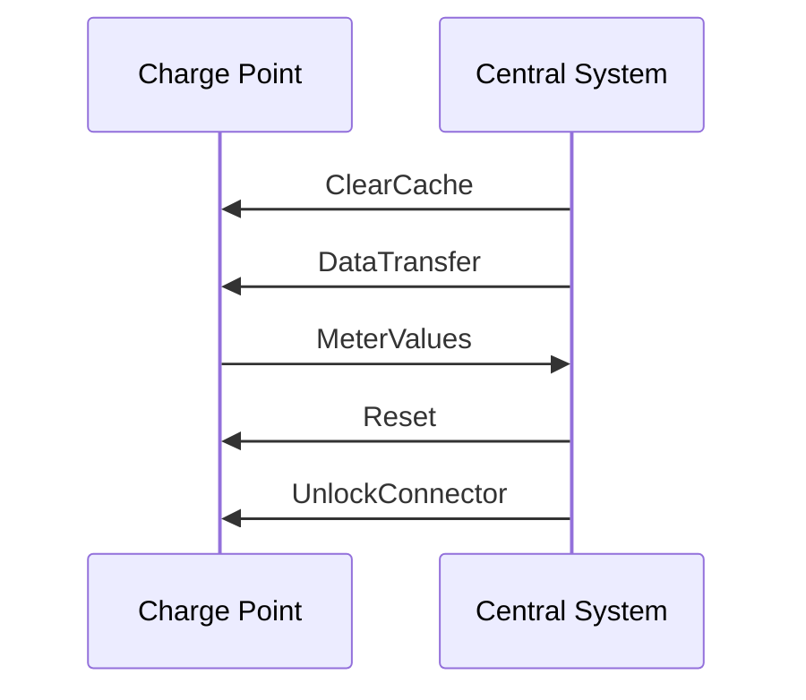

# OCPP 1.6

```mermaid
sequenceDiagram
    Alice->>+FrontDesk: CheckIn
    FrontDesk-->>-Alice: CheckIn Details. Do you want Charging?
    Alice->>+FrontDesk: Yes Need Charging

    FrontDesk->>+ EMHotelInterface: Create new charging code with details.
    EMHotelInterface->> EMBackend : Store [charging code] with details
    EMHotelInterface-->>-FrontDesk: [charging code]

    FrontDesk-->>-Alice: Here is your [charging code]

    Alice->>Alice : Scan QR Code on Scanner
    AliceMobile->>+EMChargerWebInterface : Load Terminal control page
    AliceMobile->> EMChargerWebInterface : Send Charging Code
    EMChargerWebInterface->>EMBackend : Authenticate Charger
    Alice->>Alice : Plug in vehicle
    EMBackend->>+Charger : StartCharging
    EMChargerWebInterface->>-AliceMobile : Disconnect
    Charger->>-EMBackend : StopCharging
    EMBackend->>EMHotelInterface : Show usage
```
## Implemented

```mermaid
sequenceDiagram
    participant ChPt as Charge Point
    participant CentrSys as Central System
    
    ChPt->>CentrSys: Authorize
    ChPt->>CentrSys: BootNotification
    CentrSys->>ChPt: ChangeConfiguration
    CentrSys->>ChPt: ChangeAvailability
    CentrSys->>ChPt: GetConfiguration
    ChPt->>CentrSys: Heartbeat
    CentrSys->>ChPt: RemoteStartTransaction
    CentrSys->>ChPt: RemoteStopTransaction
    ChPt->>CentrSys: StartTransaction
    ChPt->>CentrSys: StatusNotification
    ChPt->>CentrSys: StopTransaction
```

## Not Done or Partially

```mermaid
sequenceDiagram
    participant ChPt as Charge Point
    participant CentrSys as Central System
    
    CentrSys->>ChPt: ClearCache
    CentrSys->>ChPt: DataTransfer
    ChPt->>CentrSys: MeterValues
    CentrSys->>ChPt: Reset
    CentrSys->>ChPt: UnlockConnector


```
